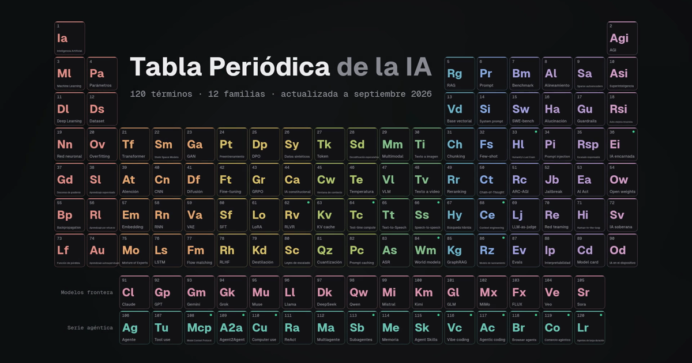

# Tabla Periódica de la IA

120 términos de inteligencia artificial organizados como la tabla periódica, de backpropagation a MCP, Agent Skills y GPT-6. Actualizada a septiembre de 2026.

**→ https://devidbarreiro.github.io/tabla-periodica-ia/**



## Cómo está organizada

| Bloque | Familias |
|---|---|
| Izquierda (s) | Fundamentos |
| Centro (d) | Arquitecturas · Entrenamiento · Inferencia · Multimodal |
| Derecha (p) | RAG y datos · Prompting y razonamiento · Evaluación · Seguridad y gobernanza |
| Última columna | Horizonte (AGI, superinteligencia…) |
| Abajo (f) | Modelos frontera · Serie agéntica |

Un punto verde marca las novedades de 2025–2026. Haz clic en un elemento para fijarlo, usa `←` `→` para navegar, `/` para buscar y marca los que ya conoces (se guarda en tu navegador).

## Estructura

- `data.js`: todos los términos y la regla que los coloca en la tabla. Es la única fuente de datos; la web y el vídeo la leen.
- `index.html`, `styles.css`, `app.js`: web estática, sin build ni dependencias.
- `video/`: vídeo promocional 1920×1080 de 40 s, sin sonido (pensado para LinkedIn), generado solo con código: canvas + ffmpeg.

```bash
cd video && npm install && npm run render   # → video/out/promo.mp4
node render.mjs --still 2.5 23               # fotogramas sueltos por segundo
```

## Contribuir

¿Falta un término o hay un dato desactualizado? Abre un issue o un PR editando `data.js`. Cada categoría tiene un número fijo de celdas, así que añadir uno implica sustituir otro.

## Licencia

MIT
